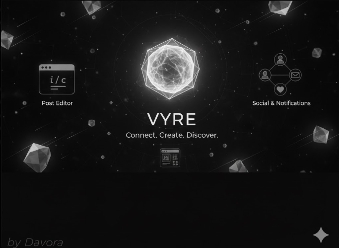

<p align="center">
  <h1 align="center">Vyre</h1>
  <p align="center">
    <strong>I build. I code. I tell stories.</strong>
  </p>
  <p align="center">
    A developer-first blog & social writing platform <br />
    where code, bugs, and lived experience intersect.
  </p>
</p>

<p align="center">
  
  
  
  
  
  
  
  
  
</p>

---

## ✨ What Is Vyre?

Vyre is **not** just a blog.

It’s a place where:

- **Personal Experiences** – Stories inspired by real-life events, written with honesty and humor.  
- **Relatable Moments** – Chaos, confusion, victories, and failures that make life memorable.  
- **Narrative Depth** – A subtle narrator’s voice guiding you through every scene, capturing sights, sounds, and emotions.  
- **Coding… but with a Twist** – Some stories touch on coding and tech, but always from a human perspective—frustration, triumph, and everything in between.  

---

Welcome to **Vyre ***, a blog where experiences, musings, and little moments come to life. This isn’t just about coding, tech, or tutorials—it’s about life as it unfolds, one story at a time.  

Here, you’ll find tales that are raw, relatable, and sometimes chaotic. From mysterious afternoons lost to stubborn bugs, to quiet moments of reflection, Vyre Stories invites you to step into someone else’s shoes—or at least peek over their shoulder.  


---

## 🧠 Philosophy

> Reflection is trying to better 
> It’s mood, memory, and momentum.

Vyre documents:
- real debugging sessions
- things that broke for no obvious reason
- the quiet relief when they finally work

You’re not reading polished tutorials here.  
You’re reading **experience**.

---

## 📰 Core Features

### ✍️ Writing & Content
- Rich-text editor powered by **TipTap**
- Image embeds, YouTube embeds, links, markdown
- Safe HTML rendering & sanitization
- SEO-friendly slug-based routing

### 👤 Users
- Username-based profiles (`/user/[username]`)
- Bio, followers, following
- Author-centric filtering

### ❤️ Engagement
- Likes with **optimistic UI**
- Comment system
- Real-time-feeling interactions without page refresh pain

### 🔄 Discovery
- Multi-author feeds
- Randomized + relevant post surfacing
- Designed for scalability as user count grows

---

## 🎨 Experience & UI

- Motion-first UI using **Framer Motion**
- Dark / light theme toggle
- Calm, minimal layouts
- Intentional transitions (nothing accidental)

Bonus:
- Experimental 3D elements powered by **Three.js / React Three Fiber**

---

## 🛠 Tech Stack

### Frontend
- **Next.js 16 (App Router)**
- **React 19**
- **TypeScript**
- Tailwind CSS
- Framer Motion
- React Three Fiber + Drei
- React Icons

### Backend
- Next.js API routes
- MongoDB + Mongoose
- Secure data models

### Auth & Security
- NextAuth.js
- Bcrypt password hashing
- Environment-based config
- Sanitized user-generated content

---

## 🚀 Getting Started

### 1️⃣ Clone the Repository
```bash
git clone https://github.com/davex-ai/Vyre.git
cd vyre

2️⃣ Install Dependencies

npm install
 ```

*** 🤝 Contributing ***

Contributions, feedback, and ideas are always welcome!
If you’d like to help improve Furreal Facts, follow these steps:

🍴 Fork the repo

🌿 Create a new branch:

```

git checkout -b feature/your-feature


💾 Commit your changes:

git commit -m "Added your amazing feature"

```

🚀 Push and open a pull request!

### Made with 💖 by [Nexora](https://github.com/davex-ai)

